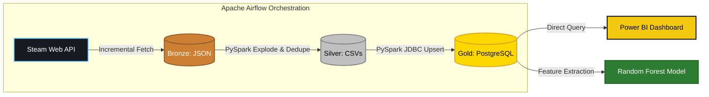
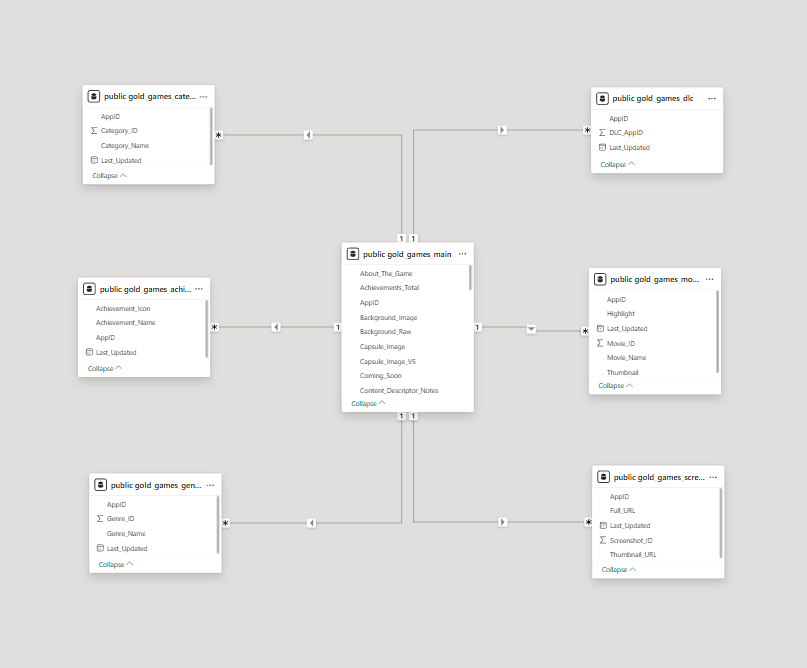
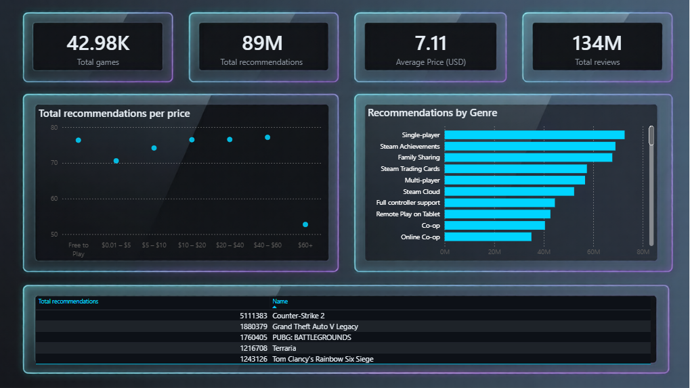
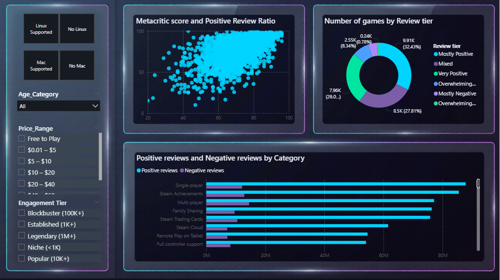
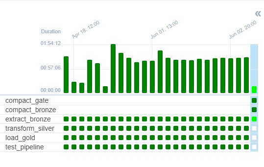
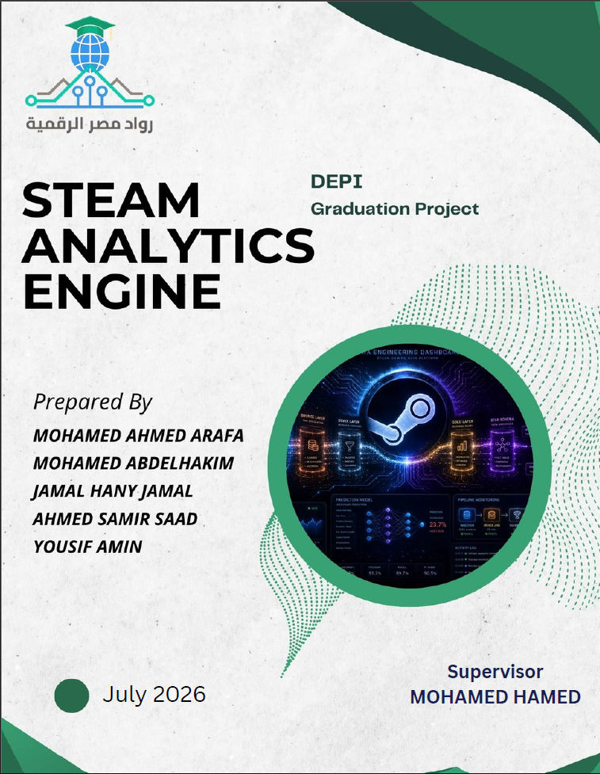
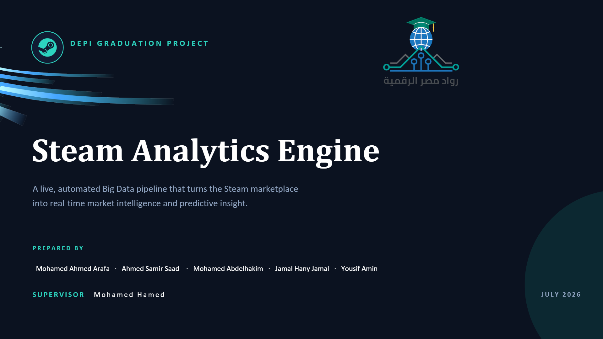

# 🎮 Steam Analytics Engine
### End-to-End Big Data ETL Pipeline with Machine Learning


> A live, automated Big Data pipeline that continuously extracts, transforms, and loads the Steam gaming marketplace into a Medallion Architecture data warehouse — extended with a Random Forest Game Success Prediction model.

> **Note:** This project is built as an **On-Premise Containerized Pipeline**, architected to allow a seamless migration to Microsoft Azure.

---

## 📋 Table of Contents

- [Project Overview](#-project-overview)
- [Architecture & Pipeline Flow](#-architecture--pipeline-flow)
- [Technical Highlights](#-technical-highlights)
- [Data Model](#-data-model-star-schema)
- [Game Success Prediction Model](#-game-success-prediction-model)
- [Power BI Dashboard](#-power-bi-dashboard)
- [Project Deliverables](#-project-deliverables)
- [How to Run Locally](#-how-to-run-locally)
- [Future Roadmap](#-future-roadmap-azure-cloud-migration)
- [Team](#-team)

---

## 🌟 Project Overview

The Steam gaming marketplace hosts over **180,000 titles** generating a continuous stream of pricing, player counts, reviews, and sentiment data. This project builds a production-grade Big Data pipeline to make sense of it all in real time.

| Metric | Value |
|---|---|
| Total Games Processed | 42,980 |
| Total Reviews | 134,000,000 |
| Total Recommendations | 89,000,000 |
| Average Game Price | $7.11 USD |
| Star Schema Tables | 7 |
| Pipeline Schedule | Hourly (Automated) |

---

## 🏗️ Architecture & Pipeline Flow

The project strictly follows the **Medallion Architecture**, orchestrating batch processing via Apache Airflow.



### Bronze Layer — Raw Ingestion
- Connects to Steam Official Partner API (`GetAppList` & `AppDetails`)
- Uses an intelligent **Priority Queue** to download JSON metadata for fresh games
- Bypasses Steam rate limits and Cloudflare blocking via a local `game_registry.json`
- Raw JSON payloads persisted to local storage as timestamped batch files
- Asynchronous **Bronze Compaction** merges old batches into monthly archives every 3 days

### Silver Layer — Cleaning & Transformation
- **PySpark** reads all Bronze JSON files via wildcard pattern for distributed processing
- Dynamically explodes deeply nested JSON arrays (Achievements, DLCs, Genres, Categories)
- HTML tags stripped from all text fields using a registered PySpark UDF
- Duplicates dropped via composite-key logic and deduplication Window functions
- Produces **7 normalized tables** staged as CSV files

### Gold Layer — Business Ready
- **PySpark** runs JDBC operations to push Silver data into **PostgreSQL**
- Strict schema enforcement via `UnionByName` commits
- Reliable **Upserts** using Window deduplication — never wipes existing data
- Post-load validation compares Silver vs Gold row counts with 0.01% tolerance

---

## 🛠️ Technical Highlights

| Feature | Description |
|---|---|
| **Priority Queue Extraction** | Targets top-played games first, skips games updated within 24 hours, discovers new games from 180,000+ catalog |
| **Bronze Compaction** | Merges hourly batch files into monthly archives using streaming line-by-line writer — prevents OOM spikes |
| **Schema Enforcement** | Forces PySpark to align column types precisely against PostgreSQL schema before `UnionByName` commits |
| **Composite Key Upserts** | Each table uses its own composite key (e.g. AppID + Genre_ID) — prevents data collapse on repeated runs |
| **Airflow ShortCircuit** | `compact_gate` uses `ShortCircuitOperator` to decouple 3-day compaction from hourly extraction |
| **Pipeline Test Suite** | Standalone integrity tests validate Bronze JSON → Silver CSV → Gold PostgreSQL after every run |
| **Complete Dockerization** | Custom Airflow image installs Java 17 and PySpark at build time — single `docker-compose up` launches everything |

---

## 📊 Data Model (Star Schema)

The destination PostgreSQL database is organized into a Star Schema optimized for Power BI reporting.

- **`games_main`** (Fact Table) — 48 columns covering Financials, Player Counts, Reviews, Base Stats
- **`games_genres`** — Exploded genre bridge table
- **`games_categories`** — Exploded category bridge table
- **`games_achievements`** — Highlighted achievements per game
- **`games_dlc`** — DLC AppID references
- **`games_screenshots`** — Full and thumbnail screenshot URLs
- **`games_movies`** — Trailer and video metadata



---

## 🤖 Game Success Prediction Model

As an extension to the core pipeline, a **Random Forest** classification model was developed to predict whether a game will succeed on the Steam platform.

| Component | Detail |
|---|---|
| Algorithm | Random Forest (Scikit-learn) |
| Training Data | Gold layer `games_main` table |
| Input Features | Price, Platform flags, Achievements, Recommendations, Positive/Negative reviews, Metacritic score, Discount % |
| Target Variable | Binary — Successful / Not Successful |
| Success Definition | Positive reviews exceed defined threshold relative to total reviews |

---

## 📈 Power BI Dashboard

The reporting layer features a dark-mode Power BI dashboard designed for market analysis and sentiment tracking.

### Market Overview & Game Reception


### Developer & Tag Performance


### Airflow DAG Execution


---

## 📁 Project Deliverables

<table>
  <tr>
    <td align="center" width="50%">
      <b>📄 Project Documentation</b><br><br>
      
      <br>Full academic report covering all pipeline layers, data model, and ML model
    </td>
    <td align="center" width="50%">
      <b>📊 Project Presentation</b><br><br>
      
      <br>DEPI graduation project presentation slides
    </td>
  </tr>
</table>

---

## 🚀 How to Run Locally

**Prerequisites:** Docker Desktop, Steam API Key (free from [steamcommunity.com/dev/apikey](https://steamcommunity.com/dev/apikey))

**1. Clone the repository**
```bash
git clone https://github.com/your-repo/steam-etl-pipeline.git
cd steam-etl-pipeline
```

**2. Configure environment variables**
```bash
cp .env.example .env
# Edit .env and add your STEAM_API_KEY and database credentials
```

**3. Build and launch the containers**
```bash
docker-compose build airflow-webserver airflow-scheduler
docker-compose up -d
```

**4. Start the pipeline**
- Navigate to `localhost:8089` (Airflow UI)
- Unpause the DAG `steam_hourly_pipeline`
- Watch the tasks execute interactively

**5. Open the dashboard**
- Open `Dashboard.pbix` in Power BI Desktop
- Import `Steam_Dark_Theme.json` via View → Themes for dark-mode styling

---

## ☁️ Future Roadmap: Azure Cloud Migration

This pipeline was designed with cloud migration in mind. Local Docker components map directly to Azure services:

| Current (On-Premise) | Azure Equivalent |
|---|---|
| Local JSON Storage (Bronze/Silver) | Azure Data Lake Storage Gen2 (ADLS) |
| Apache Spark via Docker | Azure Databricks (PySpark) |
| PostgreSQL via Docker | Azure Database for PostgreSQL |
| Apache Airflow via Docker | Azure Data Factory (ADF) |

Additional planned enhancements:
- **Real Time Streaming** — Apache Kafka or Azure Event Hubs for live player count streaming
- **SCD Type 2 Price Tracking** — Delta Lake to track historical game price changes
- **SteamSpy API Integration** — Estimated revenue and player demographic enrichment
- **Expanded ML Model** — Additional features for higher prediction accuracy

---

## 👥 Team

**DEPI Data Engineering Graduation Project — July 2026**

| Name | Role |
|---|---|
| Mohamed Ahmed Arafa | Project Introduction & Architecture |
| Ahmed Samir Saad | Bronze & Silver Pipeline |
| Mohamed Abdelhakim | Gold Layer, Dashboard & Orchestration |
| Jamal Hany Jamal | ML Model — Design & Training | 
| Yousif Amin | ML Model — Evaluation & Results |

**Supervisor:** Mohamed Hamed

---

<p align="center">
  
  
  
</p>
