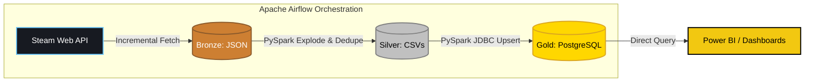
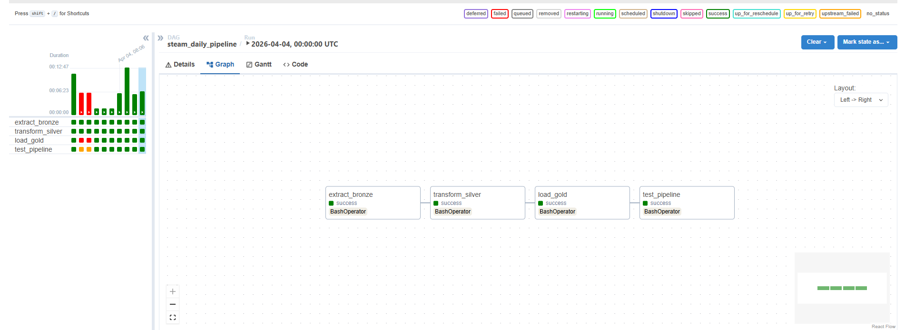

# 🎮 Steam Big Data ETL Pipeline


An automated, containerized data engineering pipeline that continuously extracts, transforms, and loads the Steam gaming marketplace into a Medallion Architecture data warehouse.

> **Note:** This project is currently built as an **On-Premise Containerized Pipeline**, architected directly to allow for a seamless "Lift-and-Shift" or Cloud-Native migration to Microsoft Azure.

---

## 🌟 What's New in V2? (Evolution from V1)
This V2 architecture completely dismantles the manual, static nature of V1 and rebuilds it into a live, autonomous big data pipeline:
* **Live API Streaming vs Static CSV:** Replaced the dead Kaggle dataset by directly integrating with Steam's live Partner APIs (GetAppList & AppDetails).
* **Automated vs Manual:** Traded Jupyter "Run All" clicks for a fully autonomous **Apache Airflow** DAG orchestration schedule.
* **Intelligent Upserts vs Overwrites:** Implemented Python Priority Queues and PySpark `Window` functions to identify stale games, discover new games incrementally, and deduplicate historical data upon PostgreSQL ingestion without wiping the database.
* **Dynamic JSON vs Flat Strings:** Upgraded PySpark scripts to computationally explode deeply nested JSON arrays (Achievements, DLCs, Genres) on the fly into a normalized 7-table Star Schema.

---

## 🏗️ Architecture & Pipeline Flow

The project strictly follows the **Medallion Architecture**, orchestrating batch processing via Apache Airflow.

1. **Bronze Layer (Raw):** 
   - Connects to the Steam Official Partner AppList API and SteamCharts API.
   - Uses an intelligent Priority Queue to download JSON metadata for fresh games, bypassing Steam's rate limits and Cloudflare blocking.
   - Raw JSON payloads are persisted to local storage.
2. **Silver Layer (Cleaned & Exploded):**
   - **PySpark** reads the complex JSON arrays (nested achievements, genres, categories).
   - Data is dynamically exploded into a relational model and normalized.
   - Duplicate arrays are dropped via composite-key logic and staged as CSVs.
3. **Gold Layer (Business Ready):**
   - **PySpark** runs JDBC operations to push the Silver data into a **PostgreSQL** database.
   - Utilizes strict schema-enforcement and `Window` deduplication to execute reliable Upserts.



---

## 🛠️ Technical Implementation Highlights

* **Priority Queue Extraction:** Because Steam limits API hits, the Python extractor contains a localized memory registry (`game_registry.json`). It targets top-played games first, skips anything updated within 24 hours, and uses remaining bandwidth to blindly discover new games out of the 180,000+ Steam catalog.
* **Schema Enforcement:** Prevents dirty CSV inferences by forcing PySpark to align column types precisely against the PostgreSQL schema before executing `UnionByName` commits.
* **Complete Dockerization:** The entire pipeline runs via `docker-compose`. A customized Airflow image installs Java 17 and PySpark dependencies dynamically at build time, granting root-level permissions to avoid cross-container volume lockouts.

---

## 📊 The Data Model (Star Schema)

The destination Postgres Database is organized into a Star Schema optimized for Power BI reporting.

* **`games_main` (Fact Table):** Contains 48 columns (Financials, Player Counts, Reviews, Base Stats).
* **Dimensions (Bridge Tables):** `games_genres`, `games_categories`, `games_screenshots`, `games_movies`, `games_dlc`, `games_achievements`.


---

## ☁️ Future Roadmap: Azure Cloud Migration

This pipeline was designed with cloud migration in mind. In the next phase, the local Docker components will map directly to Azure services:

* **Storage (Bronze/Silver):** Azure Data Lake Storage Gen2 (ADLS)
* **Compute (Transformations):** Azure Databricks (PySpark)
* **Storage (Gold):** Azure Database for PostgreSQL
* **Orchestration:** Azure Data Factory (ADF)

---

## 🚀 How to Run Locally

1. Create a `.env` file at the root containing your `STEAM_API_KEY` and Database Credentials (see `.env.example`).
2. Spin up the cluster:
   ```bash
   docker-compose build airflow-webserver airflow-scheduler
   docker-compose up -d
   ```
3. Navigate to `localhost:8089` (Airflow UI), unpause the DAG `steam_hourly_pipeline`, and watch the jobs execute interactively.
4. Open the `Dashboard.pbix` in Power BI and import the `Steam_Dark_Theme.json` file via the View > Themes tab to instantly apply the dark-mode styling.


